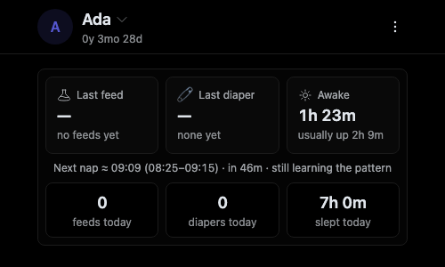
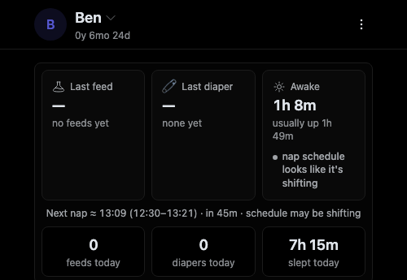
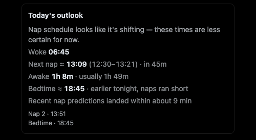

# Sleep-prediction UI — screenshots

New copy wired in by the "Wire the new sleep-prediction signals into the UI"
change. Captured from a seeded dev instance (dark theme).

## Home — thin history reads "still learning the pattern"

A child with only a few days of nap history: the estimate leans on their own
pattern but isn't settled yet, so the next-nap line ends with
`· still learning the pattern`.

## Home — a nap-count drop flags the shift

A child whose recent nap count has dropped versus two weeks ago: the sleep card
status reads `nap schedule looks like it's shifting` and the next-nap line ends
with `· schedule may be shifting`.

## Reports outlook — transition note, earlier bedtime, recent accuracy

The Reports "Today's outlook" card, showing all three new lines at once: the
transition note, a bedtime pulled `earlier tonight, naps ran short`, and
`Recent nap predictions landed within about 9 min` from the reconciled
prediction ledger.

